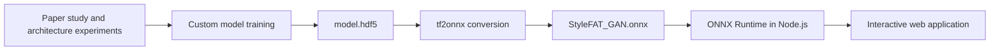
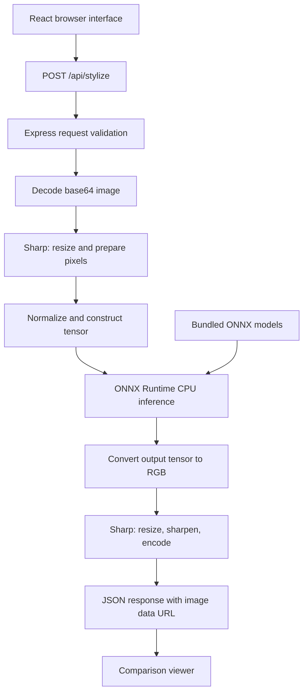

# Style-Guided Face-to-Anime Translation

### From model research and training to an end-to-end web application

**StyleFAT** is a face-to-anime image translation project that brings a custom-trained model into an interactive web experience. Upload a portrait, capture a photo, or choose a sample; generate an anime interpretation; compare it with the original; and explore image export options.

The custom **StyleFAT GAN model was developed and trained by Aryan Sehgal through the research and experimentation documented in [anime-face-generator](https://github.com/AryanSehgal/anime-face-generator)**. That work involved studying multiple papers, implementing and experimenting with model components, and building a custom model. The trained artifact was saved as [`model.hdf5`](https://github.com/AryanSehgal/anime-face-generator/blob/main/model.hdf5), subsequently converted to ONNX using **tf2onnx**, and integrated into this application for server-side inference.

**[Try the live application](https://style-guided-face-to-anime-translat-ten.vercel.app/) · [Explore the research repository](https://github.com/AryanSehgal/anime-face-generator) · [View the application source](https://github.com/AryanSehgal/style-guided-face-to-anime-translation-app)**

## Contents

- [Project overview](#project-overview)
- [Research and model development](#research-and-model-development)
- [From HDF5 to ONNX](#from-hdf5-to-onnx)
- [Application features](#application-features)
- [System architecture](#system-architecture)
- [Inference pipeline](#inference-pipeline)
- [Available models](#available-models)
- [Technology stack](#technology-stack)
- [Repository structure](#repository-structure)
- [Run locally](#run-locally)
- [API reference](#api-reference)
- [Deployment](#deployment)
- [Current scope and limitations](#current-scope-and-limitations)
- [Troubleshooting](#troubleshooting)
- [Future development](#future-development)
- [References and acknowledgments](#references-and-acknowledgments)
- [Author and project ownership](#author-and-project-ownership)

## Project overview

Face-to-anime translation involves more than changing an image's colors. A useful translation should retain recognizable aspects of the source portrait—such as pose and overall composition—while adapting facial shapes, line work, colors, and textures to an anime domain.

This project spans two connected repositories:

| Repository | Purpose |
| --- | --- |
| [anime-face-generator](https://github.com/AryanSehgal/anime-face-generator) | Research, architecture experiments, model development, notebook-based training work, and saved HDF5 artifacts. |
| [style-guided-face-to-anime-translation-app](https://github.com/AryanSehgal/style-guided-face-to-anime-translation-app) | Product interface, ONNX inference, image processing, API endpoints, and deployment configuration. |

The overall development path was **literature study → implementation and experimentation → custom model training → HDF5 checkpoint → ONNX conversion → web integration → deployment**.

The application runs the selected ONNX model within its own Node.js backend. Its stylization path does not call an external generative-image API and does not require a Gemini API key.

## Research and model development

### Research motivation

The training project explores **Style-Guided Face-to-Anime Translation (StyleFAT)**: translating a photographic face toward an anime appearance while retaining useful source structure. The research description treats local facial shape as part of style, alongside color and texture, and investigates injecting style information at multiple decoder levels.

The research repository documents the architectural motivation, component diagrams, experiments, and visual comparisons. It is the companion resource for understanding how the custom model was developed; this repository focuses on serving it through a usable application.

### Components explored

| Component | Role in the research |
| --- | --- |
| Content encoder | Explore representations of source structure and information to preserve during translation. |
| Style encoder | Explore representations of target-domain appearance and style conditioning. |
| Generator / decoder | Reconstruct a translated image from learned features and investigate how style influences different semantic levels. |
| Discriminator | Explore discrimination between face domains and generated imagery within the broader adversarial-learning approach. |
| Alternative encoder designs | Compare architectural ideas inspired by prior image-to-image translation research. |

The notebooks contain multiple approaches rather than a single uniform implementation. For example, the style-encoder notebook includes a PyTorch-style conditioning approach and a TensorFlow/Keras reconstruction experiment. The discriminator notebook explores a convolutional classifier and VGG19 feature extraction; the research README also discusses a VGG16-based design. These are records of experimentation and should not be read as an exact layer specification of the deployed ONNX graph.

### Explore the experiments

| Research artifact | What to explore |
| --- | --- |
| [Research README](https://github.com/AryanSehgal/anime-face-generator/blob/main/README.md) | Motivation, proposed component architecture, visual comparisons, and bibliography. |
| [Content Encoders.ipynb](https://github.com/AryanSehgal/anime-face-generator/blob/main/Content%20Encoders.ipynb) | Content-encoder experiments. |
| [DRIT++ Inspired Content Encoder.ipynb](https://github.com/AryanSehgal/anime-face-generator/blob/main/DRIT%2B%2B%20Inspired%20Content%20Encoder.ipynb) | A content-encoding experiment inspired by disentangled representation research. |
| [EGSC-IT Inspired Content Encoder.ipynb](https://github.com/AryanSehgal/anime-face-generator/blob/main/EGSC-IT%20Inspired%20Content%20Encoder.ipynb) | An alternative encoder/decoder experiment inspired by exemplar-guided translation research. |
| [Cycle Encoder.ipynb](https://github.com/AryanSehgal/anime-face-generator/blob/main/Cycle%20Encoder.ipynb) | Additional encoder experimentation. |
| [Style Encoder.ipynb](https://github.com/AryanSehgal/anime-face-generator/blob/main/Style%20Encoder.ipynb) | Style representation and conditioning experiments. |
| [Generator.ipynb](https://github.com/AryanSehgal/anime-face-generator/blob/main/Generator.ipynb) | Generator development work. |
| [Discriminator.ipynb](https://github.com/AryanSehgal/anime-face-generator/blob/main/Discriminator.ipynb) | Discriminator and feature-extraction experiments. |
| [model.hdf5](https://github.com/AryanSehgal/anime-face-generator/blob/main/model.hdf5) | The trained artifact used in the custom model's conversion workflow. |
| [checkpoint/best.hdf5](https://github.com/AryanSehgal/anime-face-generator/blob/main/checkpoint/best.hdf5) | An additional checkpoint retained in the research repository. |

The research objective includes reference-guided style transfer. **The current web application accepts one portrait and a predefined model selection; it does not expose a separate reference-anime-image input.**

## From HDF5 to ONNX

The training and deployment environments have different responsibilities. TensorFlow/Keras and the research notebooks support model development, while the application uses ONNX Runtime in Node.js to execute the exported model.



### Model artifacts

| Stage | Artifact | Location |
| --- | --- | --- |
| Training | `model.hdf5` | [Research repository](https://github.com/AryanSehgal/anime-face-generator/blob/main/model.hdf5) |
| Conversion | TensorFlow/Keras → ONNX with `tf2onnx` | Conversion step between research and application integration. |
| Deployment | `StyleFAT_GAN.onnx` | [`models/StyleFAT_GAN.onnx`](models/StyleFAT_GAN.onnx) |
| Execution | Model configuration and inference code | [`server/ganEngine.ts`](server/ganEngine.ts) |

[tf2onnx](https://github.com/onnx/tensorflow-onnx) provides conversion tooling for TensorFlow and Keras models. ONNX supplies the portable graph format, and ONNX Runtime executes that graph in the application backend.

The original conversion script and its exact environment are not checked into this application repository. To reproduce or update an export, restore the trained model with its required architecture/custom layers, export with compatible TensorFlow/Keras and tf2onnx versions, inspect the resulting graph, and compare its output with the original model on the same preprocessed inputs.

Pay particular attention to **input/output names, tensor layout, dimensions, and normalization**. Conversion alone does not establish that an export matches the application's inference assumptions. Update the configuration in `server/ganEngine.ts` if the exported model uses a different contract.

### Custom model serving contract

The current application configures StyleFAT as follows:

| Property | Expected value |
| --- | --- |
| Model file | `models/StyleFAT_GAN.onnx` |
| Input name | `input_image` |
| Output name | `output_image` |
| Tensor layout | NCHW: batch, channels, height, width |
| Input shape | `[1, 3, 512, 512]` |
| Input data type | `float32` |
| Input pixel range | `[-1, 1]` |
| Output interpretation | Three-channel, 512 × 512 image values in `[-1, 1]`, using the configured layout. |

These values describe the **serving code's contract**, not the input sizes or normalization used by every research notebook.

## Application features

- **Multiple image inputs:** file selection, drag-and-drop, clipboard paste, camera capture, and bundled sample portraits.
- **Custom StyleFAT inference:** the custom-trained model is the default selection.
- **Alternative styles:** Hayao and Paprika model presets are also available.
- **Interactive comparison:** split-wipe slider, side-by-side view, anime-only view, and original-only view.
- **Image inspection:** zoom and fullscreen controls.
- **Generation feedback:** progress messages, error display, model information, and inference timing.
- **Output controls:** JPEG and PNG processing, selectable export dimensions, and browser-generated comparison posters.
- **Server-side execution:** model inference runs on the backend CPU using bundled ONNX files.

**Export availability:** the local Express server implements the standalone image-export endpoint. The current Vercel API entry point implements status and stylization only. See [current scope and limitations](#current-scope-and-limitations) before relying on standalone export in the hosted app.

### Try the application

1. Open the [live project](https://style-guided-face-to-anime-translat-ten.vercel.app/).
2. Upload or paste a portrait, capture a photo, or select a sample.
3. Choose **Custom Model (StyleFAT)** or another available style.
4. Select **Generate Anime Version**.
5. Inspect the result using the comparison controls.
6. Use the available download options, subject to the deployment-specific export support described below.

For predictable framing, start with a clear, centered portrait. The backend uses a square center crop and does not perform face detection or landmark alignment.

## System architecture



The frontend is built with React and TypeScript. Express handles API requests, Sharp handles image processing, and ONNX Runtime executes the selected generator. Both the local server and Vercel API import the shared inference engine.

Model sessions are cached in memory by style. The default model is preloaded, and other models are loaded when requested. On a serverless deployment, this cache belongs to the individual function instance; it is not shared across all requests or instances.

## Inference pipeline

The main implementation is [`runGanInference`](server/ganEngine.ts).

1. **Load the selected model.** Resolve the ONNX file from `models/` and reuse a cached inference session when available. Sessions use the CPU execution provider, graph optimization, and four intra-operation threads.
2. **Prepare the image.** Decode the uploaded bytes with Sharp, center-crop/resize to 512 × 512, remove alpha, and read raw pixels for the three-channel tensor.
3. **Normalize pixels.** Convert byte values using `normalized = pixel / 127.5 - 1`.
4. **Arrange the tensor.** Construct NCHW for StyleFAT or NHWC for the Hayao and Paprika presets.
5. **Run the generator.** Feed the configured input tensor into ONNX Runtime and retrieve the configured output.
6. **Reconstruct RGB pixels.** Map output values with `pixel = round((value + 1) * 127.5)` and clamp to `[0, 255]`.
7. **Render the requested size.** Apply Lanczos3 resizing and optional sharpening for larger outputs.
8. **Encode and return.** Produce PNG or JPEG bytes and return a base64 data URL with model and timing metadata.

**Resolution terminology:** the inference grid is 512 × 512. Larger delivered images are resized outputs, not native high-resolution model inference or learned super-resolution. The export UI offers 512 × 512, 1024 × 1024, and 2048 × 2048 images; a side-by-side poster doubles the selected width.

## Available models

| API style ID | Display name | ONNX file | Layout |
| --- | --- | --- | --- |
| `style_fat` | Custom Model (StyleFAT) | `StyleFAT_GAN.onnx` | NCHW |
| `hayao` | Studio Ghibli (Hayao) | `AnimeGANv2_Hayao.onnx` | NHWC |
| `paprika` | Paprika (Satoshi Kon) | `AnimeGANv2_Paprika.onnx` | NHWC |

The custom training contribution described here applies to **StyleFAT**. The additional AnimeGANv2-named presets are separate bundled models and are not presented as custom-trained StyleFAT artifacts.

The Hayao and Paprika configurations use `generator_input:0` as the input name and `generator/G_MODEL/out_layer/Tanh:0` as the output name. Consult the `STYLES` registry in [`server/ganEngine.ts`](server/ganEngine.ts) when adding or replacing a model.

## Technology stack

| Layer | Technologies | Responsibility |
| --- | --- | --- |
| Research | Python, Jupyter notebooks, TensorFlow/Keras; PyTorch in some experiments | Architecture exploration and model development. |
| Conversion | tf2onnx, ONNX | Move the trained model into a deployment graph. |
| Frontend | React, TypeScript, Vite | User workflow and application state. |
| Styling and icons | Tailwind CSS, Lucide React | Responsive interface and controls. |
| API | Node.js, Express | Request handling and response serialization. |
| Inference | `onnxruntime-node` | Execute bundled models on CPU. |
| Image processing | Sharp | Resize, normalize pixel inputs, and encode outputs. |
| Browser export | Canvas API | Assemble side-by-side comparison posters. |
| Build | Vite, esbuild, tsx | Frontend build, server bundling, and local development. |
| Hosting | Vercel | Host the frontend and serverless API. |

Dependency versions and scripts are recorded in [`package.json`](package.json) and the committed lockfiles.

## Repository structure

```text
.
├── api/
│   └── index.ts                 # Vercel Express API entry point
├── models/
│   ├── StyleFAT_GAN.onnx        # Custom model deployment artifact
│   ├── AnimeGANv2_Hayao.onnx
│   └── AnimeGANv2_Paprika.onnx
├── public/samples/              # Bundled sample images
├── server/
│   └── ganEngine.ts             # Model registry and shared inference pipeline
├── src/
│   ├── components/
│   │   ├── CameraCapture.tsx
│   │   ├── ComparisonViewer.tsx
│   │   ├── ExportModal.tsx
│   │   ├── ImageUploader.tsx
│   │   ├── ModelStatusBadge.tsx
│   │   └── StyleSelector.tsx
│   ├── App.tsx                  # Main upload → inference → comparison flow
│   ├── main.tsx
│   ├── index.css
│   └── types.ts
├── server.ts                   # Local/standalone Express server
├── package.json
├── package-lock.json
├── bun.lock
├── tsconfig.json
├── vercel.json
└── vite.config.ts
```

## Run locally

### Prerequisites

- Node.js and npm, using a Node version compatible with the committed dependencies.
- Git.
- All three ONNX model files in `models/`.
- A platform supported by the native `onnxruntime-node` and Sharp dependencies.

Python and TensorFlow are needed for model development or reconversion, not for the application's normal inference path.

### Install and start

```bash
git clone https://github.com/AryanSehgal/style-guided-face-to-anime-translation-app.git
cd style-guided-face-to-anime-translation-app
npm ci
npm run dev
```

Open [http://localhost:3000](http://localhost:3000). The development command runs `server.ts` through `tsx`, with Vite middleware serving the frontend.

### Scripts

| Command | Purpose |
| --- | --- |
| `npm run dev` | Start the Express + Vite development server. |
| `npm run lint` | Run TypeScript checking with `tsc --noEmit`. |
| `npm run build` | Build the frontend and bundle the standalone server into `dist/server.cjs`. |
| `npm start` | Run the bundled standalone server. |

For a standalone production run on macOS/Linux:

```bash
npm run build
NODE_ENV=production npm start
```

Run from the repository root so the backend can resolve `models/`. Retain the model files and installed runtime dependencies alongside the build. Set `NODE_ENV=production` in your hosting environment when using another operating system or process manager.

### Environment variables

| Variable | Usage |
| --- | --- |
| `PORT` | Local/standalone server port; defaults to `3000`. |
| `NODE_ENV` | Set to `production` to serve the built frontend from the standalone server. |
| `DISABLE_HMR` | Set to `true` to disable Vite HMR and file watching in development. |

No external image-generation API key is required for the current ONNX inference workflow.

## API reference

### Endpoint availability

| Endpoint | Local/standalone server | Vercel API |
| --- | --- | --- |
| `GET /api/status` | Available | Available |
| `POST /api/stylize` | Available | Available |
| `POST /api/export` | Available | Not implemented in the current entry point |

### `GET /api/status`

Returns engine information, available styles, supported stylization resolutions, and output formats.

```bash
curl http://localhost:3000/api/status
```

This endpoint reports service metadata; it does not perform a test inference or prove that every model has loaded successfully.

### `POST /api/stylize`

Send an image as a base64 string or image data URL.

| Field | Type | Default | Description |
| --- | --- | --- | --- |
| `image` | string | Required | Source image bytes encoded as base64, optionally with a data URL prefix. |
| `style` | string | `style_fat` | `style_fat`, `hayao`, or `paprika`. |
| `resolution` | number | `1024` | Output dimension: `512`, `1024`, or `2048`. |
| `format` | string | `jpeg` | `jpeg` or `png`. |
| `quality` | number | `95` | JPEG quality, clamped to 70–100 by the route. |

The Vercel handler also accepts `imageBase64` and `targetResolution` aliases. Use `image` and `resolution` for compatibility with both server entry points.

Create a request from a local JPEG without manually copying its base64 contents:

```bash
node --input-type=module -e '
import fs from "node:fs";
const image = "data:image/jpeg;base64," + fs.readFileSync("portrait.jpg").toString("base64");
fs.writeFileSync("request.json", JSON.stringify({
  image, style: "style_fat", resolution: 1024, format: "jpeg", quality: 95
}));
'

curl --fail-with-body \
  http://localhost:3000/api/stylize \
  -H 'Content-Type: application/json' \
  --data-binary @request.json \
  --output response.json
```

Replace the local origin with the [live application's origin](https://style-guided-face-to-anime-translat-ten.vercel.app/) to use the deployed endpoint.

A successful response includes `success`, `stylizedImage`, `inferenceTimeMs`, `totalTimeMs`, `style`, `modelName`, `width`, `height`, and `format`. `stylizedImage` is the image data URL used by the frontend. The Vercel handler additionally returns `dataUri` and a `metrics` object for compatibility.

Save the returned image:

```bash
node --input-type=module -e '
import fs from "node:fs";
const result = JSON.parse(fs.readFileSync("response.json", "utf8"));
if (!result.success || !result.stylizedImage) throw new Error(result.error || "Missing image");
const base64 = result.stylizedImage.split(",")[1];
fs.writeFileSync("anime.jpg", Buffer.from(base64, "base64"));
'
```

The example requests JPEG. Use a `.png` filename when requesting PNG. Missing or empty image data receives HTTP 400; inference/processing failures receive HTTP 500 with an `error` message.

### `POST /api/export`

The standalone server accepts `image`, `style`, `resolution`, and `format`, then returns encoded image bytes with download headers. Supported dimensions are 512, 1024, 2048, and 4096; defaults are 2048 and PNG.

This route currently runs the inference pipeline again. The export modal sends the already-stylized image to it, so standalone export can apply a second stylization pass. See the limitations below. Browser-generated comparison posters use Canvas and do not call this route.

## Deployment

The hosted project is available at **[style-guided-face-to-anime-translat-ten.vercel.app](https://style-guided-face-to-anime-translat-ten.vercel.app/)**.

The checked-in [`vercel.json`](vercel.json) routes `/api/*` requests to `api/index.ts`, includes `models/**` in the function bundle, and configures a maximum function duration of 60 seconds.

When deploying your own copy:

1. Import the application repository into Vercel.
2. Use a Node runtime compatible with the project's dependencies and install from the committed npm lockfile.
3. Build with `npm run build` and serve the Vite frontend output from `dist`.
4. Retain the API routing and model inclusion settings in `vercel.json`.
5. Check function logs for model initialization, native dependency, or inference errors.
6. Test `/api/status`, then submit a small portrait to `/api/stylize` and verify that `stylizedImage` contains a usable image data URL.

The function needs the native ONNX Runtime and Sharp dependencies as well as the model files. Express's configured 50 MB parser limit does not override hosting-platform request, response, memory, or execution limits. Check the limits applicable to your deployment, especially for base64 uploads and large output images.

## Current scope and limitations

- **Preset selection:** the deployed interface selects a bundled model; arbitrary reference-image style conditioning is not exposed.
- **Fixed inference size:** the engine processes 512 × 512 tensors. Larger output sizes use interpolation and sharpening.
- **Square framing:** preprocessing uses a centered square crop; it does not detect or align faces.
- **Export parity:** `api/index.ts` does not currently implement `/api/export`, so the hosted standalone portrait-download action can fail even when stylization succeeds.
- **Export behavior:** the local export route re-runs the model, and its UI caller supplies the generated image. An export-only resize/encode path would preserve the displayed result more faithfully.
- **Cold starts and throughput:** CPU inference and model initialization affect latency. Warm-instance caching helps, but no fixed latency or concurrency guarantee is claimed.
- **Research reproducibility:** the notebooks contain experimental configurations and local dataset paths. This application does not include a pinned training environment, original conversion script, or a complete benchmark report.
- **Quality evaluation:** visual material is available in the research repository, but this README makes no quantitative accuracy, FID, or state-of-the-art claim.

### Image handling

Images are uploaded to the application backend for inference; computation is not browser-only. The current request handlers process images in memory and do not implement an image database or upload archive. The inference path does not forward images to an external generative-image API. Hosting infrastructure and operational logging are separate from this application-level behavior.

## Troubleshooting

| Symptom | What to check |
| --- | --- |
| Blank result after a successful API request | Confirm the response contains `stylizedImage`. The frontend reads this field; returning only `dataUri` is insufficient. |
| Model file not found | Check that all ONNX files exist in `models/`, that the process starts from the repository root, and that Vercel includes the model directory. |
| Input/output tensor error | Compare graph names, layouts, dimensions, and data types with the selected model's configuration. |
| Distorted, dark, or incorrect colors | Verify the exported model's normalization and RGB/channel expectations against preprocessing and postprocessing. |
| First request is slow | Inspect cold-start/model-loading time separately from warm inference time. |
| Standalone download fails on Vercel | The current serverless entry point lacks `/api/export`; implement the route or use a client-side download of the returned image. |
| Export looks different from the preview | The local export endpoint currently performs another inference pass on the supplied image. |
| Large request is rejected | Reduce the source image size and inspect hosting limits; increasing Express's parser limit alone is insufficient. |
| Camera is unavailable | Check browser permission and use HTTPS or localhost. |

## Future development

Potential next steps include:

- Share route implementations and response types between local and serverless entry points.
- Add export support on Vercel and separate image export from model inference.
- Publish the original tf2onnx conversion script, dependency versions, and model equivalence checks.
- Add a model card documenting training data, model configuration, evaluation, and known failure cases.
- Introduce face-aware cropping and more explicit image/channel validation.
- Explore reference-anime-image conditioning in the product interface.
- Measure warm/cold inference latency and evaluate throughput under concurrent requests.
- Add deployment smoke tests covering generation and downloads.

These are development directions, not claims about features already implemented.

## References and acknowledgments

### Project resources

- [Live application](https://style-guided-face-to-anime-translat-ten.vercel.app/)
- [Application repository](https://github.com/AryanSehgal/style-guided-face-to-anime-translation-app)
- [Research and training repository](https://github.com/AryanSehgal/anime-face-generator)
- [Research architecture discussion and bibliography](https://github.com/AryanSehgal/anime-face-generator/blob/main/README.md)
- [Original HDF5 artifact](https://github.com/AryanSehgal/anime-face-generator/blob/main/model.hdf5)
- [Deployed custom ONNX artifact](models/StyleFAT_GAN.onnx)

### Research context

The project builds on ideas from the image-to-image translation and style-transfer literature. Relevant reading includes:

| Work | Connection to the project |
| --- | --- |
| [AniGAN: Style-Guided Generative Adversarial Networks for Unsupervised Anime Face Generation](https://arxiv.org/abs/2102.12593) | Research context for reference-guided face-to-anime translation and adaptation of facial appearance. |
| [DRIT++: Diverse Image-to-Image Translation via Disentangled Representations](https://arxiv.org/abs/1905.01270) | Disentangled representation research connected to the explicitly named DRIT++-inspired encoder experiment. |
| [Exemplar Guided Unsupervised Image-to-Image Translation with Semantic Consistency](https://arxiv.org/abs/1805.11145) | Exemplar-guided translation research connected to the explicitly named EGSC-IT-inspired encoder experiment. |

The [training repository's bibliography](https://github.com/AryanSehgal/anime-face-generator#references--) also lists foundational work on GANs, neural style transfer, adaptive instance normalization, CartoonGAN, and StarGAN, as well as dataset resources. These references acknowledge the surrounding research; they do not imply that every cited method or dataset is part of the deployed model.

### Engineering tools

- [tf2onnx](https://github.com/onnx/tensorflow-onnx) — TensorFlow/Keras-to-ONNX conversion.
- [ONNX Runtime](https://github.com/microsoft/onnxruntime) — model execution.
- [Sharp](https://github.com/lovell/sharp) — image processing.
- [React](https://github.com/facebook/react), [Vite](https://github.com/vitejs/vite), and [Express](https://github.com/expressjs/express) — application infrastructure.

## Author and project ownership

**[Aryan Sehgal](https://github.com/AryanSehgal)** — custom StyleFAT model training, research-to-ONNX integration, and development of the end-to-end application, with the research experiments documented in the companion repository.

The custom model work builds on published research and the project team's implementation and experimentation. Credit for the original papers, external tools, and separately bundled models remains with their respective authors.

No license file is currently included in this application repository. Check the applicable permissions and upstream terms before redistributing code, weights, or datasets; this README does not assign a license to them.
